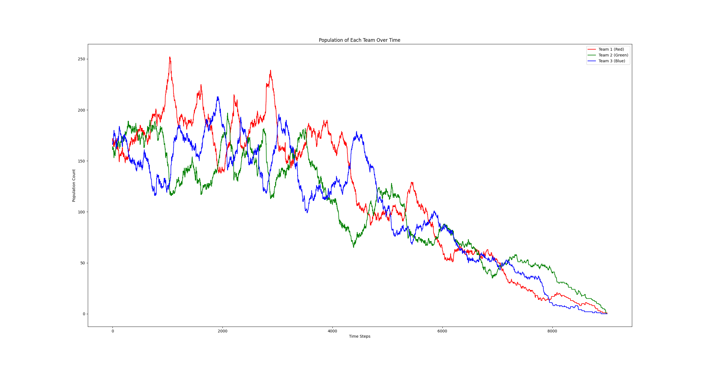

# Predator–Prey Simulation (PyGame)

A simulation that models the interaction of three competing teams (red, green, blue).  

This was originally developed as a school project to demonstrate my ability to combine **Python, PyGame, spatial hashing, and vector-based movement heuristics**.

---

## Features

- **Three Teams**:  
  - Rock–paper–scissors style relations (`1 eats 2`, `2 eats 3`, `3 eats 1`).
- **Entity Behavior**:
  - Entities seek out the closest prey.
  - Entities flee if predators are in range.
  - Otherwise, they wander randomly.
- **Toroidal World**:  
- **Spatial Hash Grid**:
  - Efficient neighbor lookup (only checks nearby cells instead of all mobs).
  - Toggle visibility with `G`.
- **Mob Stats**:
  - Each mob has a randomized **age**, **hunger**, and **speed**.
  - If hunger or age depletes → mob dies.
- **Interaction Visualization**:
  - Click a mob to see its relations to others in range.
  - Lines are drawn:
    - Green = prey
    - Red = predators
- **Graph at End**:
  - When the simulation ends, a matplotlib graph shows population history for each team.

---

## Controls

- **Mouse click on a mob** → Show its stats (age, hunger) and relations to nearby mobs.  
- **`G` key** → Toggle spatial hash grid visualization.  
- **Close window** → Ends simulation and displays the population graph.

---

## Configuration

You can tune the simulation via constants in `main.py`:

- `NUM_MOBS` → starting population  
- `WIDTH, HEIGHT` → world size  
- `SIGHT_RANGE`, `GRID_FACTOR` → perception and hash grid density  
- `MIN_AGE`, `MAX_AGE`, `BASE_HUNGER` → survival parameters  
- `COLORS`, `RELATIONS` → team setup
- And other configurations such as screen size and displayed mob size.

Currently, adding a new team requires editing these values manually. A future improvement would be to centralize configuration in a JSON/YAML file for easier customization.

---

## Technical Highlights

- **Vector-based Movement**  
  - Uses normalized vectors to determine efficient flee/chase direction.  
  - Multiple predators → weighted flee vector.  
  - Prey → closest-target pursuit.

- **Toroidal Distance**  
  - Distances wrap around edges instead of stopping at borders.  
  - Optimized by avoiding square roots (using squared distance).

- **Spatial Hashing**  
  - Divides space into grid cells.  
  - Mobs only check interactions in nearby cells, cutting computation cost drastically.

- **Emergent Dynamics**  
  - Populations fluctuate naturally as predators overhunt or prey clusters grow.  
  - Simulation ends when no mobs remain.

---

## Future Work

Some things I’d like to add if time allowed:

- **AI-driven decision making**:
  - Maybe something like reinforcement learning outisde of PyGame.
  - A reward function that mainly focus on team survival and partially indivudial hunger to maximize the team survival rate.  
- **Config files or UI menus** for easier setup and adding extra teams.  
- **User controls**:
  - Spawn mobs during runtime.
  - Adjust parameters live.
- **Better visualization**:
  - Heatmaps of movement.
  - Survival curves.
- **And of course more optimizations**

---

## Example Output

At the end of a run, the simulation produces a graph like this:

---

*This README.md was quicly made with ChatGPT, purely to combine the multiple Dutch .md files I had for the school projecdt ;)*
